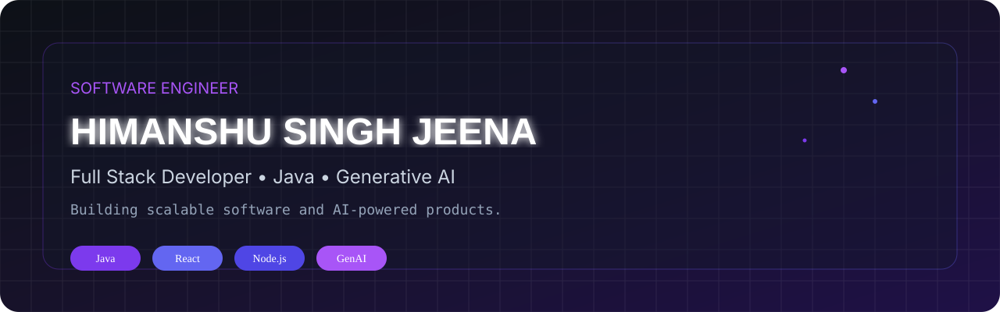

<div align="center">



<br>


<br>

<a href="https://portfolio-hsj.onrender.com/">

</a>

<a href="https://www.linkedin.com/in/himanshu-singh-jeena/">

</a>

<a href="mailto:himanshujeena9718@gmail.com">

</a>

<a href="https://github.com/Himanshusinghjeena">

</a>

<br><br>


</div>

---

---

## About Me

I'm an **MCA student** and **Software Engineer** passionate about building scalable software and AI-powered applications.

I enjoy transforming ideas into production-ready products using **Java**, the **MERN Stack**, and **Generative AI**. My recent work includes AI-assisted recruitment systems and Retrieval-Augmented Generation (RAG) applications.

Currently, I'm deepening my knowledge of **Spring Boot**, **System Design**, **Docker**, **Kubernetes**, and modern backend engineering while strengthening my problem-solving skills through Data Structures and Algorithms.

I'm actively seeking opportunities to contribute to impactful software products, collaborate with engineering teams, and continue growing as a software engineer.

---

## Tech Stack

<table>
<tr>

<td valign="top" width="25%">

### Languages

<p align="center">

<br>
<br>
<br>


</p>

</td>

<td valign="top" width="25%">

### Frontend

<p align="center">

<br>
<br>
<br>


</p>

</td>

<td valign="top" width="25%">

### Backend

<p align="center">

<br>
<br>


</p>

</td>

<td valign="top" width="25%">

### Tools

<p align="center">

<br>
<br>
<br>


</p>

</td>

</tr>
</table>

### AI & Development

<p align="center">


</p>

---

---

## Featured Projects

<table>

<tr>

<td width="50%" valign="top">

### 🚀 ResumeAI

AI-powered resume analyzer that compares resumes against job descriptions using **Google Gemini**, providing ATS scoring, resume optimization, interview preparation, and AI-assisted career guidance.

**Tech Stack**

`React` `Node.js` `Gemini API`

**Repository**

🔗 https://github.com/Himanshusinghjeena/ResumeAI

</td>

<td width="50%" valign="top">

### 📄 QueryDoc

A Retrieval-Augmented Generation (RAG) application that enables users to upload PDFs and ask natural-language questions using semantic search with LangChain and FAISS.

**Tech Stack**

`Python` `LangChain` `FAISS` `Gemini`

**Repository**

🔗 https://github.com/Himanshusinghjeena/QueryDoc

</td>

</tr>

<tr>

<td width="50%" valign="top">

### 💼 Job Portal

A MERN-based recruitment platform with recruiter authentication, candidate management, and application tracking designed to simplify hiring workflows.

**Tech Stack**

`MongoDB` `Express` `React` `Node.js`

**Repository**

🔗 https://github.com/Himanshusinghjeena/Job-Portal

</td>

<td width="50%" valign="top">

### 🌐 My Portfolio

A modern responsive portfolio highlighting projects, technical skills, and development journey with a clean UI and optimized performance.

**Tech Stack**

`React` `Tailwind CSS`

**Repository**

🔗 https://github.com/Himanshusinghjeena/MyPortfolio

</td>

</tr>

</table>

---
---

# Experience

## React Developer Trainee

### Chetu Inc.

**June 2024 — November 2024**

Worked on enterprise frontend applications using React while collaborating in Agile development teams.

### Responsibilities

- Developed reusable React components
- Integrated REST APIs
- Improved UI responsiveness
- Optimized frontend performance
- Worked with Git & GitHub
- Participated in code reviews

---

# Education

### Master of Computer Applications

**Institute of Engineering & Technology (IET), Lucknow**

2025 – Present

---

### Bachelor of Computer Applications

**I.T.S Mohan Nagar, Ghaziabad**

2021 – 2024

---

## GitHub Analytics

<div align="center">


</div>

<br>

<div align="center">


</div>

<br>

<div align="center">


</div>

---

---

# Contribution Activity

<div align="center">


</div>

---

## Current Focus

```yaml
Learning:
  - Spring Boot
  - System Design
  - Docker
  - Kubernetes

Building:
  - AI Recruitment Platform
  - Intelligent RAG Applications

Exploring:
  - Agentic AI
  - Cloud Native Development

Open To:
  - Software Engineering Roles
  - Full Stack Development
  - AI Application Development
```

---

## Let's Connect

<div align="center">

<a href="https://portfolio-hsj.onrender.com/">

</a>

<a href="https://www.linkedin.com/in/himanshu-singh-jeena/">

</a>

<a href="https://github.com/Himanshusinghjeena">

</a>

<a href="mailto:himanshujeena9718@gmail.com">

</a>

</div>

---

---

# 2026 Goals

- Build production-ready AI applications.
- Master Spring Boot & Backend Engineering.
- Learn Docker & Kubernetes.
- Contribute consistently to Open Source.
- Solve 500+ DSA problems.
- Prepare for Software Engineering interviews.

---

# Quote

<div align="center">

### Thanks for stopping by 👋

*"I believe great software is built through curiosity, consistency, and continuous learning."*

<br>

⭐ If you enjoy my work, consider starring my repositories.

</div>

---

# Thanks for Visiting

<div align="center">

If you find any of my projects interesting, consider giving them a ⭐.

I'm always open to learning, collaborating, and building impactful software.

<br><br>


</div>

---

<p align="center">


</p>
